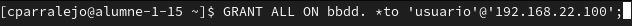
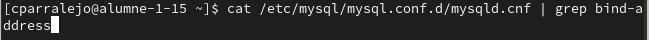
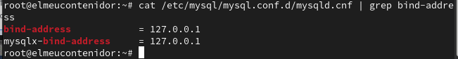
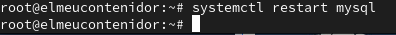
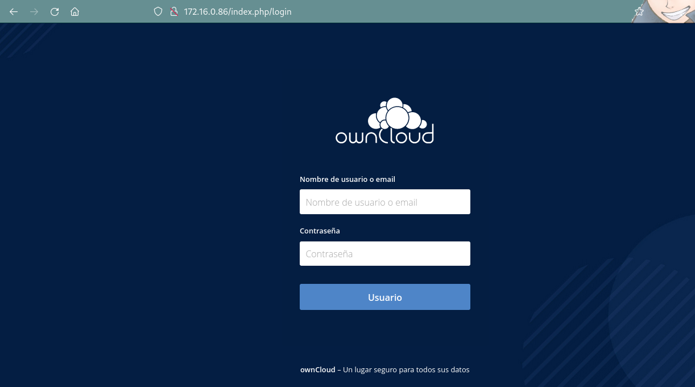
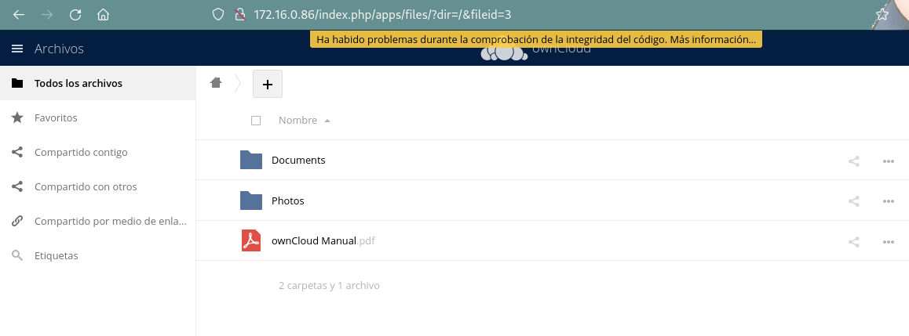

*Una vez tengamos instaladas dichas aplicacions crearemos una base de datos y un*
*usuario en MySQL para ello entraremos a mysql con el comando "mysql"*

*y pondremos el siguiente comando "mysql -u root" con esto crearemos*

*entraremos dentro del mysql y podremos modificar las cosas ahi*

*Y ahora crearemos la base de datos con el siguiente comando*
*"CREATE DATABASE ELNOMBREQUETUQUIERAS;"*
 *y ahora crearemos un usuario con el que accederemos a la base de datos*

*"CREATE USER 'elmeuusuari'@'localhost' IDENTIFIED WITH mysql_native_password BY 'password';"*

*Usaremos el comando "GRANT ALL ON bbdd. to 'usuario'@'localhost'para darle permisos al usuario*

*Le daremos privilegios de usuario para que se pueda conectar una persona externamente*
*"GRANT ALL ON bbdd. *to 'usuario'@'192.168.22.100';"*

*Ahora haremos exit para salir de este perfil que hemos creado con nuestra base*
*de datos y procederemos a poner el siguiente comando para comprobar si todo*
*funciona correctamente "mysql -u elmeuusuari -p"*

*con este comando podremos ver la bind address que tendremos que cambiar para poder acceder externamente "cat /etc/mysql/mysql.conf.d/mysqld.cnf | grep bind-address"*

*Nos saldra esto y cambiaremos el 127.0.0.1 por 0.0.0.0 bind-address = 127.0.0.1*

*Hacemos un "systemctl restart mysql" para reiniciar el sistema y aplicar los cambios.*

*Ahora volvemos a acceder a la ip dicha en el manual de instalacion y ahora veremos lo siguiente*

*Ahora pondremos el usuario y la contraseña que hemos puesto anteriormente, entramos y ya veremos los archivos que guardemos en nuestro contenedor*

