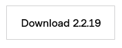
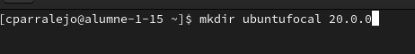
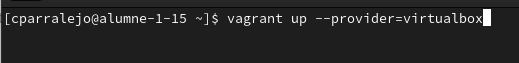
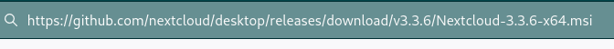
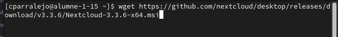
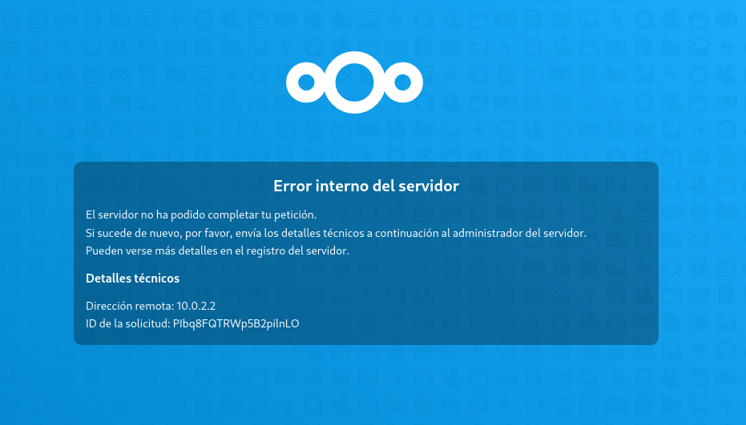

*Primeramente descargaremos el archivo "vagrantfile" lo podremos hacer desde este link "https://www.vagrantup.com/"*Le daremos al boton de descarga*  

*Una vez descargado el vagrantfile crearemos un directori donde poder trabajar con Ubuntu-focal 20.0.0*
*Para ello utilizaremos el comando "mkdir Nombrequetuquieras"*

*con esto crearemos el directorio una vez creado el directorio procederemos a entrar a el con el comando cd y el nombre que le hayamos asignado, una vez dentro pondremos el siguiente comando para crear nuestra maquina donde trabajaremos "vagrant init ubuntu/focal64"*
*Cuando ya la tengamos preparado pondremos el siguiente comando "vagrant up --provider=virtualbox"*
*con esto prepararemos la maquina que creamos anteriormente*
*Ahora iremos directamente a descargar el nextcloud*
*Para descargarlo iremos a la pagina oficial y copiaremos el link de descarga*
 *una vez compiado el link de descarga nos iremos a la consola y podremos wget + el link que hemos copiado anteriormente,*
 *una vez lo tengamos descargado, instalaremos unzip, con el comando sudo apt install unzip, y una vez instalado haremos unzip nextcloud.zip y se extraera el archivo, una vez extraido ya podemos hacer cd y entrar a la carpeta, una vez dentro podremos acceder al link en internet y ver que nos saldra este error, para evitar el error tendremos que configurarlo*

