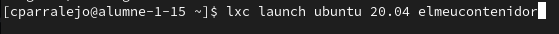
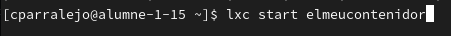
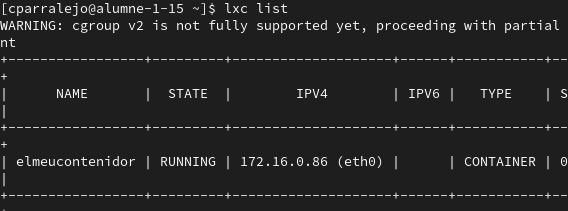
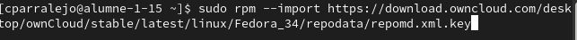
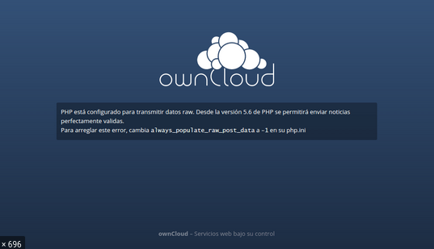

*Primer paso ejecutaremos el comando "lxc launch ubuntu:20.04 elmeucontenidor"*
*con esto abremos creado el contenedor donde vamos a trabajar.*

*Acto seguido encenderemos el contenedorque acabamos de crear en caso de que este*
*este apagado y lo haremos con el comando "lxc start elmeucontenidor"*

*Ahora comprobaremos si esta en funcionamiento nuestro contenedor usando el*
*comando "lxc list" alli podtremos observar los contenedores que tenemos creados*
*y ver si estan en funcionamiento.*

*Ahora crearemos una key para poder acceder a este conntenedor con ssh*
*para ello utilizaremos el siguiente comando "ssh-keygen -f ~/.ssh/elmeucontenidor -N ""*

*con esto ya tendremos la clave creada para verla simplemente tenemos que usar el*
*comando "cat ~/.ssh/elmeucontenidor.pub"*

*Añadiremos la key en la siguiente direccion "vim /root/.ssh/authorized_keys"*

*Una vez esta el contenador creado entraremos al mismo con el siguiente comando*
*"lxc exec elmeucontenidor bash" con este comando entraremo en root del contenedor*
*que hemos creado*

*Ahora instalaremos algunas aplicaciones dentro del contenedor como por ejemeplo*
*apache 2, mysql server lo haremos con los siguientes comandos "apt install apache2" "apt install mysql-server"*
*"apt install php libapache2-mod-php"*

*Ahora instalaremos owncloud*

*Nos dirigimos a la pagina de owncloud y copiamos el enlace de descarga, nos vamos a la consola y hacemos*
*un wget "link de la pagina"*

*una vez descargado moveremos el archivo a la carpeta donde se hallaba nuestro contenedor y borraremos el html de apache sustituyendolo por los archivos descargados hecho todo esto usaremos el comando ip -c a y copiaremos la ip, ahora la pondremos en nuestro navegador y alli comprobaremos que tengamos el owncloud activo*

*Cuando entremos en la ip veremos lo siguiente*

*Y para poder acceder tendremos que configurarlo*
